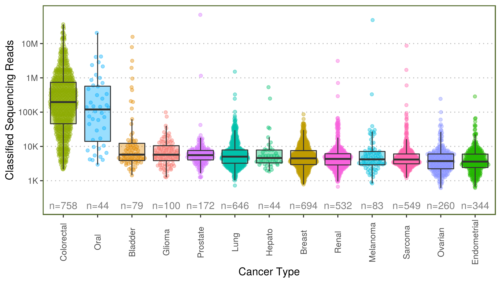
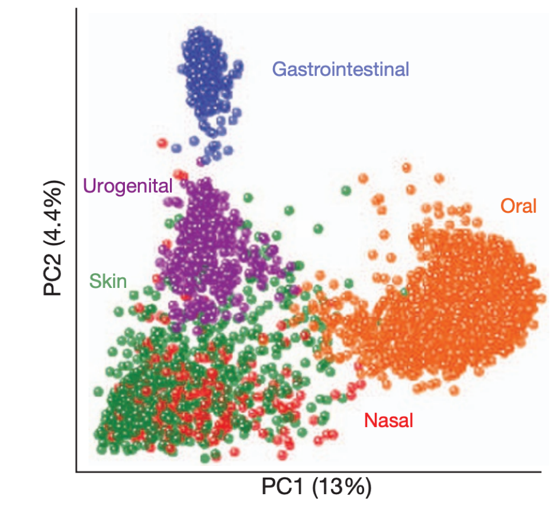
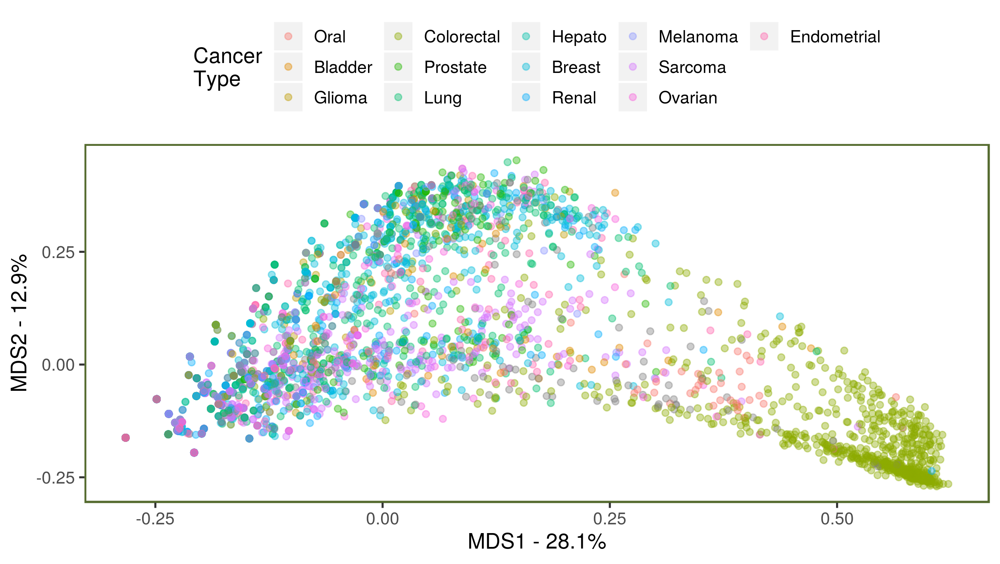

```{r, include=FALSE}
knitr::opts_chunk$set(echo = FALSE,
                      warning = FALSE,
                      tidy = FALSE,
                      message = FALSE,
                      fig.align = 'center',
                      out.width = "100%")
options(knitr.table.format = "html") 
#load/install required libraries
list.of.packages <- c('tidyverse','posterdown','ggpubr', 'devtools', 'kableExtra')
new.packages <- list.of.packages[!(list.of.packages %in% installed.packages()[,"Package"])]
if(length(new.packages)) install.packages(new.packages)

library(posterdown)
library(tidyverse)
library(ggpubr)
library(devtools)
library(kableExtra)

new.packages <- !(c('emo') %in% installed.packages()[,"Package"])
if(length(new.packages)) devtools::install_github("hadley/emo")

#load packages required with devtools
library(emo)

#read in required data for plots later


#data frame for contaminant, importance and whether evidence was found in published literature (eisenhofer et al. 2019)
contaminant_rankings <- data.frame( Genus = c("Enterococcus", "Curvibacter", "Methylobacterium", "Sphingomonas", "Variovorax", "Actinomyces", "Bradyrhizobium", "Burkholderia", "Cutibacterium", "Hammondia", "Kocuria", "Micrococcus", "Ralstonia", "Sphingobium", "Streptococcus"),
                                    contaminant_ranking = c(1,2,3,4,5,6,7,8,9,10,11,12,13,14,15),
                                    Literature = c("&#x2705;", "&#x2705;", "&#x2705;","&#x2705;",
                                                   " ",
                                                   "&#x2705;", "&#x2705;","&#x2705;",
                                                   " "," "," "," ","&#x2705;","&#x2705;", "&#x2705;"))


```

# Background

The involvement of _H. pylori_ with gastric carcinoma[@RN102] and the success of the Human papillomavirus vaccine in preventing cervical cancers[@RN138] are testament to the prominent role that pathogens play in cancer. 

In whole genome sequencing, microorganisms in close proximity to the human sample can be incidentally sequenced[@RN455]. Therefore, the 100,000 genome project data provides a rich resource for detecting microorganisms and linking them to disease.

We benchmarked software to devise the best approach for cancer whole genome sequence metagenomics. The top performing pipelines are provided in a tool called [SEPATH](https://github.com/UEA-Cancer-Genetics-Lab/sepath_tool_UEA) [@RN454] which is currently being applied to all cancer samples in the 100,000 genomes project. [SEPATH](https://github.com/UEA-Cancer-Genetics-Lab/sepath_tool_UEA) performs the following:

* Extracts unmapped reads from BAM files
* Quality trimming & human read removal
* Metagenomic classification - Kraken/mOTUs2[@RN72; @RN391]

`Summary: Bacteria/viruses exist naturally in our bodies but some are linked with cancer. These are sequenced alongside human DNA. We developed an approach to retain and classify non-human sequences.`

### Objectives

* `r emo::ji('check')` Develop pathogen detection pipeline
* `r emo::ji('growth')` Run pipeline on cancer sequence data 
* `r emo::ji('growth')` Characterise contamination 
* `r emo::ji('hourglass')` Investigate associations with disease 

# Methods

[SEPATH](https://github.com/UEA-Cancer-Genetics-Lab/sepath_tool_UEA) was run on all cancer samples (v6, _n_=5,311).

**Pathogenic Read Counts:** <br>
Genera present in $\leq15$ samples were removed from analysis and data filtered to only fresh-frozen PCR-free samples of the most common cancer types (_n_=4,305). 

**Principal Coordinates Analysis (PCoA):**<br>
A minimum read threshold of 50 was applied to genera from the fresh-frozen PCR-free dataset containing all cancers (_n_=4,527). Genera and samples without reads were removed and Jaccard distances were obtained using the [vegan](https://cran.r-project.org/web/packages/vegan/index.html) package. 

**Contaminant Importance:**<br>
Potential contaminants were investigated on unfiltered data using [Boruta](https://cran.r-project.org/web/packages/Boruta/index.html) feature selection[@BORUTA] to predict technical variables: _preparation method, library type, tissue source, handling trust, DNA amount, genome build, coverage homogeneity, fragment size, AT drop, GC drop, chimeric percentage, QC status, sample concentration_.

`Summary: For 5,311 cancer samples, we used mathematical approaches to determine whether each microorganism occurred in the patient or was introduced during processing.`

<br>

# Results

###Classified Pathogen Reads Per Sample

Colorectal and oral cancers demonstrate higher numbers of classified sequencing reads compared to other tumours. Background numbers of reads are present accross all tumour types (Figure \@ref(fig:readfigure)). 786/1,534 Genera remained after filtering. 

```{r, readfigure, fig.cap='Number of reads classified at genus level per tumour sample (_n_=4,305)', out.width="108%"}
  
```

<br>

### Sample Similarity

**What we expect:**<br>
We expect body site to separate each sample as demonstrated in the human microbiome project[@RN457] (Figure \@ref(fig:hmpfigure)).

```{r, hmpfigure, fig.cap='Principal coordinates analysis from the human microbiome project. Point colour denotes sampling site. (bray curtis distance, 16s ribosomal RNA gene classification, genus level). Adapted from the human microbiome project consortium, 2012 [@RN457].', out.width="80%"}
  
```

<br>
<br>
**What we found:**<br>
Examining relationships between cancer samples in the 100,000 genomes project shows that apart from colorectal, samples appear highly mixed suggesting background contamination (Figure \@ref(fig:pcoafigure)). 

```{r, pcoafigure, fig.cap='Principal coordinates analysis showing sample similarity (Jaccard distance).', out.width="108%"}
  
```

<br>

### Top Potential Contaminants

429 Genera demonstrated utility in predicting technical variables. The top 15 are compared to a recent meta-analysis contaminants below[@RN456].

```{r, contaminant_table}
contam_table <- knitr::kable(
  contaminant_rankings, format = "html",
  align = c("l","c", "c"), col.names = c("Genus","Importance <br> Ranking", "Contaminant in\nLiterature"),
  escape = FALSE)
column_spec(contam_table, 1, italic=TRUE)
```

# Conclusions

* 1,534 unique genera reported so far
* Contamination can occur at any point from sample collection to analysis
* Efforts are being made in differentiating real results from contaminants to denoise sparse metagenomic data and enable interpretation of the results

`Summary: Finding pathogens in cancer sequences is like finding a needle in a haystack. We need develop an approach to make it easier by removing the hay.`


# Future Tasks

* Introduce covariates (age, gender, ethnicity) in the method to detect contaminants
* Determine threshold of contanimant removal that produces the greatest cancer type separation
* Produce a final list of high confidence findings to share with other GECIPs

## Acknowledgements

Thanks to participants, staff and to [Big C](http://www.big-c.co.uk/) for making this research possible.
This research was made possible through access to the data and findings generated by the 100,000 Genomes
Project; [http://www.genomicsengland.co.uk](http://www.genomicsengland.co.uk)

```{r, logos, out.width="100%"}
  knitr::include_graphics("resources/logos.png")
```

*Note: * This poster was produced in R. Details and code to reproduce this poster can be found: [https://github.com/Agihawi/Gel_Conference_Poster_1](https://github.com/Agihawi/Gel_Conference_Poster_1)

### References
